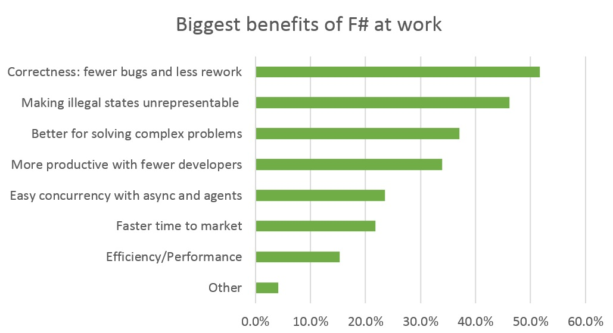

- title: Domain Driven Design with F#
- author : Matthew Crews
- theme : simple
- transition : default

***

# Domain Driven Design with F#

***

## Introduction

### What we are going to cover

- What is Domain Driven Design (DDD)
- What is the benefit of DDD
- Why is F# uniquely suited for DDD
- Application of DDD with F# do a purchasing domain
- Some gotchas and overcoming them

***

### Who am I?

- Matthew Crews, Developer and Optimization Engineer
- Favorite language is whatever solves the problem well (F#, C#, C++, SQL, VBA, whatever)
- F# is my primary language but I still consider myself novice to Functional Programming
- I like clear, robust, and elegant code
- Twitter: @McCrews
- Website: matthewcrews.com

***

## Domain Driven Design

***

### Where does it come from?

The term "Domain Driven Design" comes from Eric Evans. It was used in his book of the the same title.

- Focus of the project is on the Domain and the Domain Logic
- Design of the solution should depend on the Domain Model
- Domain and Domain Logic are the result of intense collaboration between the Developer and the Domain Expert
- Implementation for the Domain and Domain Logic is not just code but also documentation of how the process works

***

### The Goal

A Domain Expert should be able to look at the code and verify whether the logic is correct, even if they don't necessarily know the language

> "The purpose of abstraction is not to be vague, but to create a new semantic level in which one can be absolutely precise."
>> **Edsger Dijkstra**

***

### What are the concepts

- **Context:** The conceptual umbrella that everything falls under
- **Domain:** Define a clear boundary for what the project or solution is about so that you can say "No" to everything not in that boundary
- **Model:** The set of abstractions used to solve problems in the given Domain. This includes objects and functions.
- **Ubiquitous Language:** The consistent way of describing objects and activities within the Context that is shared with the Developers and Domain Experts (What we have here is a failure to communicate)

***

### What does that look like

- **Entities:** An object which is identified by its identity.
- **Value Object:** An object which has value but no identity. Immutable by default.
- **Aggregate:** A collection of Entities which are bound together and must be treated as a whole.
- **Domain Event** An event which the domain expert cares about.
- **Service:** An operation that does not belong to any object.
- **Repository:** A method for retrieving Domain Objects which is storage method agnostic
- **Factory:** An object (or function) for creating Domain Objects which can be swapped out

' Entity: Purchase Order Line, Customer, Sales Order Line
' Value Object: Shipping Address
' Aggregate: Purchase Order, Sales Order
' Domain Event: Purchase Order Placed, Purchase Order Shipped, Sales Order Placed
' Service: Purchase Order Placement Service, Shipment Processing Service
' Repository: SQL DB Client, Document Store Client

***

### Why should I care?

- By accurately modeling the domain, it is easier to discuss the solution with Domain Experts and Business Users
- Helps with refactoring because the domain is more fully represented

***

## F# + DDD = <3

***

### What is F#?

- A Functional-First, statically typed language
- First released in 2005
- Runs on top of the .NET Runtime (cross platform)
- An ancestor of OCaml
- It is a pragmatic functional language (i.e. you can write non-Functional Code)
- Great for OO and Procedural Programming
- Same performance as C#

***



Petricek, Thomas. “F# In Numbers: A Look at the Annual F# Survey Results.” InfoQ, 5 Aug. 2016, www.infoq.com/articles/fsharp-community-survey-2016

***

### What separates Functional from Imperative Programming?

- Everything can be thought of as a function
- Functional Programming uses expressions instead of commands
- All code returns something, even if that something is `unit` (The closest thing to `void` in F#)
- Functions are first class citizens and are often parameters to other functions

***

### Why do I care about Functional Programming?

***

- data-background : images/gears.jpg

***

### Complexity

It is the way we are starting to solve our most complex problems

- **UI** with React, Redux, Elm
- **Distributed Systems** with Event Sourcing
- **Scalability** with cloud lambdas/functions (Azure Functions, AWS Lambda)
- **Dependency Management** with Dependency Injection (by another name is function as a parameter)

***

### What makes F# great for DDD

- Algebraic type system for easy composition of types
- Zero friction for defining many types
- Units of Measure
- Robust type inference (not checking)
- Match statement based branching

***

### What is up with these Algebraic Types

F# has an algebraic type system which makes is simple and efficient to accurately model a domain. This comes in the form of a terse syntax for defining Product Types (Tuples, Records), Sum Types (Discriminated Unions) and Type Aliases.

***

### Product Types

#### Tuples

```fsharp
type Point = float * float
```

#### Records

```fsharp
type Chicken = {
    Name : string
    Size : float
    Color : string
}

type Cow = {
    Name : string
    Weight : float
    Breed : string
}
```

***

### Sum Types

**Discriminated Union:** A type which enforces dealing with various sub-types (commonly abbreviated DU)

```fsharp
type Point = {
    X : float
    Y : float
}

type Shape =
    | Segment of Point * Point
    | Triangle of Point * Point * Point
    | Square of Point * Point * Point * Point

type Color = Red | Brown | White

type Chicken = {
    Name : string
    Size : float
    Color : Color
}
```

***

### Single Case DU

A simple way for providing context for primitive types

```fsharp
type InventoryId = InventoryId of string
type UnitCost = UnitCost of decimal
type VisitsPerHour = VisitsPerHour of float
```

***

## Application to a Purchasing Domain

***

- data-background : images/finance.jpeg

***

### The Problem Statement

- We need to create a domain for performing costing calculations
- We cannot afford making a poor recommendation
- The model needs to be easy to maintain since strategies evolve
- Ideally we want to model the restrictions of our domain within the types themselves
- Relying on a Developer to remember to validate a number will fail (i.e. Checking for non-negativity)

***

- data-background : images/diagram-domain.jpeg

***

### The Domain

- **Stock Item:** The items that we sell on Marketplaces. These represent physical units of inventory  
- **Days of Inventory:** The number of days which we would like to have a Stock Item in stock  
- **Sales Rate:** The daily rate which we have or expect to make sales  
- **Item Quantity:** A count of a particular Stock Item
- **Order Quantity:** The Number of units that we want to purchase  

***

### Naive Stock Item Model

```csharp
public class StockItem {
    public string InventoryId { get; }
    public decimal UnitCost { get; }
    public float SalesRate { get; }

    public StockItem(string inventoryId, decimal unitCost, float salesRate){
        InventoryId = inventoryId;
        UnitCost = unitCost;
        SalesRate = salesRate;
    }
}
```

' Question
' Is any string an acceptable `InventoryId`?
' Can you have an InventoryId with infinite length?
' Can a `UnitCost` really take on any value a `decimal` can?
' Can you have negative `UnitCost`?
' Do we ever expect to see a `SalesRate` less than `0.0`?
' What can we do to restrict the domains of these values?
' What is the worst consequence of this?

***

### Two Ways of Seeing Boundaries

#### Boundary for Oppression


***

### Two Ways of Seeing Boundaries

#### Boundary for Freedom


***

### Stock Item Model

For proper DDD we would like to restrict the values of 

- `InventoryId`
- `UnitCost`
- `SalesRate`

Let's look at doing this in F#

***

#### InventoryId Questions

- Q: What different values can show up in an `InventoryId`?  
- A: Values??  
- Q: You know, can it have letters, numbers, symbols, etc.  
- A: Well, it's always letters and numbers.  
- Q: Okay, can it be just a single letter?  
- A: No, it is always at least 5  
- Q: Can it be an any number of letters or numbers?  
- A: Oh no, it is never more than 20  

***

### InventoryId Model

```fsharp
type InventoryId = InventoryId of string

module InventoryId =
    let tryCreate (id:string) =
        let isLettersAndNumbers = Regex.Match(id, "^[a-zA-Z0-9]+$")
        if (isLettersAndNumbers.Success) && id.Length >= 5 && id.Length <= 20 then
            Some (InventoryId id)
        else
            None
```

***

### UnitCost Questions

- Q: Do you ever have \$0.0 cost items?  
- A: No, we call those samples and we replenish with a different system  
- Q: What is the most expensive item you've purchased?  
- A: Oh, we have had items up to \$1,000  
- Q: If an item came in with a cost over say \$2,000, would you want a warning of some kind?  
- A: I don't need an immediate warning but we would probably need a report to find those instances?
- Q: Should I exclude items with that high of cost?  
- A: Yes, we would not want to make a purchasing recommendation with an errant cost in the system  

***

### UnitCost Model

```fsharp
type UnitCost = UnitCost of decimal

module UnitCost =
    let tryCreate unitCost =
        if unitCost > 0M && unitCost < 2000M then
            Some (UnitCost unitCost)
        else
            None
```

' Yes, hardcoding the $2000 is bad form but this is just an example

***

### SalesRate Model

```fsharp
type SalesRate = SalesRate of float

module SalesRate =
    let tryCreate salesRate =
        if salesRate >= 0.0 then
            Some (SalesRate salesRate)
        else
            None
```

' We ask a similar series of questions about the SalesRate model for this this

***

```fsharp
type StockItem = {
    InventoryId : InventoryId
    UnitCost : UnitCost
    SalesRate : SalesRate
}

module StockItem =
    let create inventoryId unitCost salesRate =
        {
            InventoryId = inventoryId
            UnitCost = unitCost
            SalesRate = salesRate
        }

    let tryCreate inventoryId unitCost salesRate =
        let inventoryIdResult = InventoryId.tryCreate inventoryId
        let unitCostResult = UnitCost.tryCreate unitCost
        let salesRateResult = SalesRate.tryCreate salesRate

        match inventoryIdResult, unitCostResult, salesRateResult with
        | Some id, Some cost, Some rate ->
            Some (create id cost rate)
        | _, _, _ ->
            None
```

***

### Replenishment Calculations

```csharp
public static class Replenishment {
    public static float PurchaseQuantity(float targetDaysOfInventory, 
        StockItem stockItem)
    {
        var purchaseQuantity = targetDaysOfInventory * stockItem.SalesRate;

        return purchaseQuantity;
    }

    public static float PurchaseValue(float purchaseQuantity, 
        StockItem stockItem)
    {
        var purchaseValue = purchaseQuantity * stockItem.UnitCost;

        return purchaseValue;
    }
}
```

' Questions:
' What can go wrong here?
' Days of Inventory could be zero or negative leading to wild behavior
' What happens if numbers are negative?
' Point out that DaysOfInventory should have a restricted domain

***

### Days Of Inventory Model

```fsharp
type DaysOfInventory = DaysOfInventory of float

module DaysOfInventory =
    let tryCreate daysOfInventory =
        if daysOfInventory > 0. then
            Some (DaysOfInventory daysOfInventory)
        else
            None
```

***

### Replenishment Module

```fsharp
module Replenishment =
    let purchaseQuantity doiTarget (stockItem:StockItem) =
        let quantity (DaysOfInventory doi) (SalesRate rate) =
            doi * rate

        quantity doiTarget stockItem.SalesRate  
```

' What do we do if we just want to support the multiplication of `DaysOfInventory` and `SalesRate`?

***

### Adding Operators

```fsharp
type DaysOfInventory = DaysOfInventory of float with
    static member (*) (DaysOfInventory d, SalesRate s) =
        ItemQuantity (d * s)
```

We now update our `purchaseQuantity` function.

```fsharp
module Replenishment =
    let purchaseQuantity (daysOfInventory:DaysOfInventory) (stockItem:StockItem) =
        daysOfInventory * stockItem.SalesRate
        |> OrderQuantity.ofItemQuantity
// val purchaseQuantity : DaysOfInventory -> StockItem -> OrderQuantity
```

***

### Updated Requirement

> "We want to adjust the DOI Target for our StockItems based on their Profit Category. Cat 1 should get a 10 DOI Bonus. Cat 2 should get no bonus. Cat 3 should get a 15 DOI Penalty."
>> The Boss

New Term for the Ubiquitous Language  
**Profit Category:** The profit grouping that a Stock Item belongs to

***

### Profit Category Model

```fsharp
type ProfitCategory =
    | Cat1
    | Cat2
    | Cat3

type StockItem = {
    InventoryId : InventoryId
    UnitCost : UnitCost
    SalesRate : SalesRate
    ProfitCategory : ProfitCategory
}

```

***

### Replenishment Module : Take 2

```fsharp
module Replenishment =
    let purchaseQuantity (DaysOfInventory doiTarget) (stockItem:StockItem) =
        let (SalesRate salesRate) = stockItem.SalesRate
        match stockItem.ProfitCategory with
        | Cat1 -> ItemQuantity ((doiTarget + 10.0) * salesRate)
        | Cat2 -> ItemQuantity (doiTarget * salesRate)
        | Cat3 -> ItemQuantity ((doiTarget - 15.0) * salesRate)
        |> OrderQuantity.ofItemQuantity
// val purchaseQuantity : DaysOfInventory -> StockItem -> OrderQuantity
```

' Question
' What possible error have we introduced?
' How do we avoid doing this? (Don't work with base types. Work with domain types as much as possible.)
' How do we fix it?

***

### Updated Days Of Inventory Model

```fsharp
type DaysOfInventory = DaysOfInventory of float with
    static member (+) (DaysOfInventory d1, DaysOfInventory d2) =
        DaysOfInventory (d1 + d2)

    static member (-) (DaysOfInventory d1, DaysOfInventory d2) =
        if d1 > d2 then
            DaysOfInventory (d1 - d2)
            |> Some
        else
            None

    static member (*) (DaysOfInventory d, SalesRate s) =
        ItemQuantity (d * s)
```

***

### Replenishment Module : Take 3

```fsharp
module Replenishment =
    let purchaseQuantity doiTarget (stockItem:StockItem) =
        let doi =
            match stockItem.ProfitCategory with
            | Cat1 ->
                doiTarget + (DaysOfInventory 10.0)
                |> Some
            | Cat2 ->
                doiTarget
                |> Some
            | Cat3 ->
                doiTarget - (DaysOfInventory 15.0)

        match doi with
        | Some d -> d * stockItem.SalesRate
        | None -> ItemQuantity 0.0
```

***

### A Critique

The `DaysOfInventory` type is now a pain to use whenever we need to subtract (which is often). By always having subtraction produce an `Option<DaysOfInventory>` we have to always use a match case to get to the value inside.

#### The Response

Yes, this is annoying but it is also forcing us to deal with a very real possibility. Let's see if there is anything we can do about that...

***

### Overload Operators

```fsharp
type DaysOfInventory = DaysOfInventory of float with
    static member (+) (DaysOfInventory d1, DaysOfInventory d2) =
        DaysOfInventory (d1 + d2)

    static member (-) (DaysOfInventory d1, DaysOfInventory d2) =
        if d1 > d2 then
            DaysOfInventory (d1 - d2)
            |> Some
        else
            None

    static member (-) (d1:Option<DaysOfInventory>, d2:DaysOfInventory) =
        match d1 with
        | Some d1s -> d1s - d2 |> Some
        | None -> None
```

***

### Another critique

The `StockItem.tryCreate` function has a small `match` statement in it right now. In the real world, there would be more properties on that type. Won't the `match` statement explode in size? Won't that become onerous to maintain?

### Response

Yes, yes it will. F# offers another tool for dealing with this called *Computation Expressions*.

***

### My First Computation Expression

#### The Maybe builder

```fsharp
type Maybe () =
    member this.Bind(opt, func) = opt |> Option.bind func
    member this.Return v = Some v

let maybe = Maybe ()
```

***

```fsharp
module StockItem =
    let create inventoryId unitCost salesRate profitCategory =
        {
            InventoryId = inventoryId
            UnitCost = unitCost
            SalesRate = salesRate
            ProfitCategory = profitCategory
        }

    let tryCreate inventoryId unitCost salesRate profitCategory =
        maybe {
            let! inventoryId = InventoryId.tryCreate inventoryId
            let! unitCost = UnitCost.tryCreate unitCost
            let! salesRate = SalesRate.tryCreate salesRate
            return (create inventoryId unitCost salesRate profitCategory)
        }
```

***
### Takeaways

- DDD is a great system for getting clarity on how a domain should function
- The aim is to create a unified language around a problem so everyone understands what is going on
- The Domain Model is a tool for the Developer and the Domain Expert
- The Domain Model is a means of communication, not just computation
- DDD is not for every problem
- DDD can feel cumbersome but the return on reliability and maintainability may be worth it

***

## Resources

### Books

"Domain Driven Design" by Eric Evans  
"Domain Driven Design Made Functional" by Scott Wlaschin  
"Get Programming with F#" by Isaac Abraham

### Websites

fsharpforfunandprofit.com by Scott Wlaschin  
fsharp.org  
sergeytihon.com by Sergey Tihon

